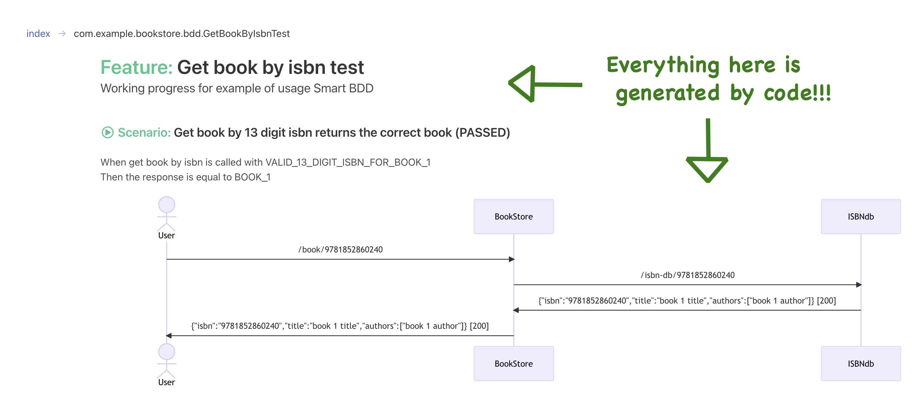

## This is a comparison of Cucumber and Smart BDD using Java and JUnit5.

Cucumber is the leading Behavior-driven development (BDD) framework. It is language agnostic and integrates with other
frameworks. You write the specification/feature, then write the glue code, then write the test code.

With Smart BDD you write the code first using best practices and this generates:

* Interactive feature files that serve as documentation
* Diagrams to better document the product

The barrier to entry is super low, you start with one annotation or add a file to resources/META-INF!
That's it you're generating specification/documentation. Please note I will interchange specification, feature and
documentation through.

The difference in approach leads to Smart BDD

* To having less code and higher quality code
* Therefore, less complexity
* Therefore, lowering the cost of maintaining and adding testing
* Therefore, increasing productivity
* Oh and you get sequence diagrams (see below) plus many new features are in the pipeline

Both goals are same in nutshell - specifications that serve as documentation that exercise tests.

Implementing BDD with Cucumber, will give you benefits. However, there is a technical cost to adding and maintaining
feature files. This means extra work has to be done.

There are 3 main layers: feature file, glue code, test code:

* You write the feature file
* Then the glue code
* Then the test code

This approach leads to - we'll explore in more with code detail below:

* To having more code and lower quality code due workarounds for limitations and quirks to this process
* Therefore, more complexity
* Therefore, increasing the cost of maintaining and adding testing
* Therefore, decreased coverage

It's time to try and back these claims up - lets check the latest examples of
Cucumber - https://github.com/cucumber/cucumber-jvm/tree/main/examples/calculator-java-junit5

Create a repo with one example calculator-java-junit5 copy and pasted over.

### First let's implement the Cucumber solution

Feature file

```gherkin
Feature: Shopping

  Scenario: Give correct change
    Given the following groceries:
      | name  | price |
      | milk  | 9     |
      | bread | 7     |
      | soap  | 5     |
    When I pay 25
    Then my change should be 4
```

Java source code

```java
public class ShoppingSteps {

    private final RpnCalculator calc = new RpnCalculator();

    @Given("the following groceries:")
    public void the_following_groceries(List<Grocery> groceries) {
        for (Grocery grocery : groceries) {
            calc.push(grocery.price.value);
            calc.push("+");
        }
    }

    @When("I pay {}")
    public void i_pay(int amount) {
        calc.push(amount);
        calc.push("-");
    }

    @Then("my change should be {}")
    public void my_change_should_be_(int change) {
        assertEquals(-calc.value().intValue(), change);
    }
    // omitted Grocery and Price class
}
```

Mapping for test input

```java
public class ParameterTypes {

    private final ObjectMapper objectMapper = new ObjectMapper();

    @DefaultParameterTransformer
    @DefaultDataTableEntryTransformer
    @DefaultDataTableCellTransformer
    public Object transformer(Object fromValue, Type toValueType) {
        return objectMapper.convertValue(fromValue, objectMapper.constructType(toValueType));
    }
}
```

Test runner

```java
/**
 * Work around. Surefire does not use JUnits Test Engine discovery
 * functionality. Alternatively execute the
 * org.junit.platform.console.ConsoleLauncher with the maven-antrun-plugin.
 */
@Suite
@IncludeEngines("cucumber")
@SelectClasspathResource("io/cucumber/examples/calculator")
@ConfigurationParameter(key = GLUE_PROPERTY_NAME, value = "io.cucumber.examples.calculator")
public class RunCucumberTest {
}
```

build.gradle.kts showing the cucumber config

```kotlin
dependencies {
    testImplementation("io.cucumber:cucumber-java")
    testImplementation("io.cucumber:cucumber-junit-platform-engine")
}

tasks.test {
    // Work around. Gradle does not include enough information to disambiguate
    // between different examples and scenarios.
    systemProperty("cucumber.junit-platform.naming-strategy", "long")
}
```

### Secondly we will implement the Smart BDD solution

```java

@ExtendWith(SmartReport.class)
public class ShoppingTest {
    private final RpnCalculator calculator = new RpnCalculator();

    @Test
    void giveCorrectChange() {
        givenTheFollowingGroceries(List.of(
                item("milk", 9),
                item("bread", 7),
                item("soap", 5)
        ));
        whenIPay(25);
        myChangeShouldBe(4);
    }

    public void whenIPay(int amount) {
        calculator.push(amount);
        calculator.push("-");
    }

    public void myChangeShouldBe(int change) {
        assertThat(-calculator.value().intValue()).isEqualTo(change);
    }

    public void givenTheFollowingGroceries(List<Grocery> groceries) {
        for (Grocery grocery : groceries) {
            calculator.push(grocery.getPrice());
            calculator.push("+");
        }
    }
    // omitted Grocery class 
}
```

build.gradle.kts showing the smart BDD config

```kotlin
dependencies {
    testImplementation("io.bit-smart.bdd:report:0.1-SNAPSHOT")
}
```

This generates

```
Scenario: Give correct change (PASSED)
Given the following groceries list of
  "milk" 9
  "bread" 7
  "soap" 5
When I pay 25
My change should be 4
```

Notice how more simple Smart BDD is, much less moving parts. 1 test class vs 4 files.

With have removed feature file. The feature file has a few main draw backs:

* It adds complexity of mapping between itself and the source code
* As an abstraction it will leak in to bottom layers
* It is very hard to keep feature files consistent
* When developing with your IDE, it will need to support the feature file, frequently you'll be left with no support

You don't have these drawbacks in Smart BDD, in fact it promotes bests practices and productively.

### In the next section I'll try to demonstrate the complexity of Cucumber

Let's dive in something more advanced:

* A dollar is 2 of the currency below.
* Visa payments take 1 currency processing fee

```gherkin
When I pay 25 "Dollars"
Then my change should be 29
```

It is reasonable to think that we can add this method

```java
@When("I pay {int} {string}")
public void i_pay(int amount,String currency){
   calc.push(amount*exchangeRate(currency));
   calc.push("-");
}
```

However, this is the output

```text
Step failed
io.cucumber.core.runner.AmbiguousStepDefinitionsException: "I pay 25 "Dollars"" matches more than one step definition:
"I pay {int} {string}" in io.cucumber.examples.calculator.ShoppingSteps.i_pay(int,java.lang.String)
```

Here is where the tail starts to wag the dog, you embark of investing time and more code to work around the framework.
We should always strive for simplicity, additional code and in a boarder sense additional features will always make code
harder to maintain.

We have 3 options:

1. Mutate `i_pay` method to handle a currency. If we had 10's or 100's occurrences of `When I pay ..` this would be
   risky and time-consuming. When we add "Visa" payment method we are starting to add complexity to an existing method.
2. Create a new method doesn't start with `I pay`. It could be `With currency I pay 25 "Dollars"`. Not idea as this
   isn't really what wanted. It looses discoverability. How would we add "Visa" payment method?
3. Use multiple steps `I pay` and `with currency`. This is the most maintainable solution. For discoverability, you'd
   need a consistent naming convention. With a large codebase, good luck with discoverability, as they are loosely
   coupled in the feature file, but coupled in code.

Option 1, is the one have seen the most - God glue methods with very complicated regular expression, with Cucumber
Expressions it's the cleanest code I have seen. According to cucumber documentation conjunction steps are an
anti-pattern https://cucumber.io/docs/guides/anti-patterns/?lang=java. If I added a payment
method `I pay 25 "Dollars" with "Visa"` I don't know if this constitutes the conjunction step anti-pattern. If we get
another requirement, "Visa" payments doubled on a "Friday", setting the day surly constitutes another step.

Option 3 is really a thin layer on a builder. Below shows one possible implementation of a builder. We can see this
approach, adding the day of the week would be trivial (as we've chosen to use the builder pattern).

```gherkin
When I pay 25
When With currency "Dollars"
```   

```java
public class ShoppingSteps {

    private final ShoppingService shoppingService = new ShoppingService();
    private PayBuilder payBuilder = new PayBuilder();

    @Given("the following groceries:")
    public void the_following_groceries(List<Grocery> groceries) {
        for (Grocery grocery : groceries) {
            shoppingService.calculatorPush(grocery.getPrice().getValue());
            shoppingService.calculatorPush("+");
        }
    }

    @When("I pay {int}")
    public void i_pay(int amount) {
        payBuilder.withAmount(amount);
    }

    @When("with currency {string}")
    public void i_pay_with_currency(String currency) {
        payBuilder.withCurrency(currency);
    }

    @Then("my change should be {}")
    public void my_change_should_be_(int change) {
        pay();
        assertEquals(-shoppingService.calculatorValue().intValue(), change);
    }

    private void pay() {
        final Pay pay = payBuilder.build();
        shoppingService.calculatorPushWithCurrency(pay.getAmount(), pay.getCurrency());
        shoppingService.calculatorPush("-");
    }
    // builders and classes omitted
}
```

Let's implement this in Smart BDD:

```java

@ExtendWith(SmartReport.class)
public class ShoppingTest {
    private final ShoppingService shoppingService = new ShoppingService();
    private PayBuilder payBuilder = new PayBuilder();

    @Test
    void giveCorrectChange() {
        givenTheFollowingGroceries(List.of(
                item("milk", 9),
                item("bread", 7),
                item("soap", 5)
        ));
        whenIPay(25);
        myChangeShouldBe(4);
    }

    @Test
    void giveCorrectChangeWhenCurrencyIsDollars() {
        givenTheFollowingGroceries(List.of(
                item("milk", 9),
                item("bread", 7),
                item("soap", 5)
        ));
        whenIPay(25).withCurrency("Dollars");
        myChangeShouldBe(29);
    }

    public PayBuilder whenIPay(int amount) {
        return payBuilder.withAmount(amount);
    }

    public void myChangeShouldBe(int change) {
        pay();
        assertEquals(-shoppingService.calculatorValue().intValue(), change);
    }

    public void givenTheFollowingGroceries(List<Grocery> groceries) {
        for (Grocery grocery : groceries) {
            shoppingService.calculatorPush(grocery.getPrice());
            shoppingService.calculatorPush("+");
        }
    }

    private void pay() {
        final Pay pay = payBuilder.build();
        shoppingService.calculatorPushWithCurrency(pay.getAmount(), pay.getCurrency());
        shoppingService.calculatorPush("-");
    }
    // builders and classes omitted
}
```

Let's count the number of lines:

* Cucumber: ShoppingSteps 123 + ParameterTypes 21 + RunCucumberTest 16 + shopping.feature 20 = Total: 180 lines
* Smart BDD: ShoppingTest 116 lines = Total: 116 lines

| Cucumber                  |       Smart BDD        |
|:--------------------------|:----------------------:|  
| ShoppingSteps 123 lines   | ShoppingTest 116 lines | 
| ParameterTypes 21 lines   |                        |
| runCucumberTest 16 lines  |                        |
| shopping.feature 20 lines |                        |
| Total 180 lines           |    Total 116 lines     |

Hopefully I have demonstrated the simplicity and productivity of Smart BDD.

### PLease see following for an example of using diagrams with Smart BDD.


This is source code:

```java

@ExtendWith(SmartReport.class)
@SpringBootTest(webEnvironment = SpringBootTest.WebEnvironment.RANDOM_PORT)
public class BookControllerIT {
    // skipped setup...

   @Override
   public void doc() {
     featureNotes("Working progress for example of usage Smart BDD");
   }
   
   @BeforeEach
   void setupUml() {
       sequenceDiagram()
         .addActor("User")
         .addParticipant("BookStore")
         .addParticipant("ISBNdb");
   }
   
   @Order(0)
   @Test
   public void getBookBy13DigitIsbn_returnsTheCorrectBook() {
     whenGetBookByIsbnIsCalledWith(VALID_13_DIGIT_ISBN_FOR_BOOK_1);
     thenTheResponseIsEqualTo(BOOK_1);
   }

   private void whenGetBookByIsbnIsCalledWith(String isbn) {
      HttpHeaders headers = new HttpHeaders();
      headers.setAccept(singletonList(MediaType.APPLICATION_JSON));
      response = template.getForEntity("/book/" + isbn, String.class, headers);
      generateSequenceDiagram(isbn, response, headers);
   }

   private void generateSequenceDiagram(String isbn, ResponseEntity<String> response, HttpHeaders headers) {
      sequenceDiagram().add(aMessage().from("User").to("BookStore").text("/book/" + isbn));


      List<ServeEvent> allServeEvents = getAllServeEvents();
      allServeEvents.forEach(event -> {
         sequenceDiagram().add(aMessage().from("BookStore").to("ISBNdb").text(event.getRequest().getUrl()));
         sequenceDiagram().add(aMessage().from("ISBNdb").to("BookStore").text(
                 event.getResponse().getBodyAsString() +  " [" + event.getResponse().getStatus() + "]"));
      });

      sequenceDiagram().add(aMessage().from("BookStore").to("User").text(response.getBody() + " [" + response.getStatusCode().value() + "]"));
   }

    // skipped helper classes...
}
```

In my opinion the above does a very good job of documenting the Book Store.

Smart BDD is being actively developed, I'll try to reduce the code required for diagrams, potentially use annotations.

I use the method `whenGetBookByIsbnIsCalledWith` in the example above, as this is the most appropriate abstraction. If
we had more requirements, then the code _could_ look more like below. This is at the other end of the spectrum, work has
gone in to a test API to make testing super easy. With is approach notice how consistent the generated documentation
will be. It will make referring to the documentation much easier.

```java
public class GetBookTest extends BaseBookStoreTest {

    @Override
    public void doc() {
        featureNotes("Book Store example of usage Smart BDD");
    }

    @Test
    public void getBookWithTwoAuthors() {
        given(theIsbnDbContains(aBook().withAuthors("author", "another-author")));
        when(aUserRequestsABook());
        then(theResponseContains(aBook().withAuthors("author", "another-author")));
    }
}
```
SmartBDD is allowing me chose the abstraction/solution that I feel is right, without a framework getting in way and or
adding to my workload.

----

Reference:

* Cucumber examples https://github.com/cucumber/cucumber-jvm/tree/main/examples/calculator-java-junit5
* Cucumber skeleton project https://github.com/cucumber/cucumber-java-skeleton.git

Creation log:

```shell
mkdir smart-bdd-examples
cd smart-bdd-examples
gradle init
```

```text
Select type of project to generate:
  1: basic
  2: application
  3: library
  4: Gradle plugin
Enter selection (default: basic) [1..4] 1

Select build script DSL:
  1: Kotlin
  2: Groovy
Enter selection (default: Kotlin) [1..2] 1

Project name (default: smart-bdd-examples):
Generate build using new APIs and behavior (some features may change in the next minor release)? (default: no) [yes, no]

> Task :init
To learn more about Gradle by exploring our Samples at https://docs.gradle.org/8.2/samples
```
